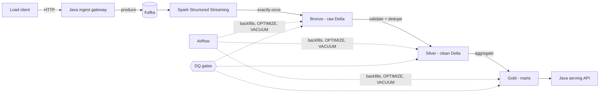

# Streamhouse

**A real-time transaction lakehouse, built in the open.** *Target architecture:* a
Java 21 ingest gateway feeds Kafka, Spark Structured Streaming lands it in a Delta
Lake medallion with exactly-once guarantees and data-quality gates, and a Java
serving API reads the marts back out. Runs on a laptop.

*Built so far:* the whole Python medallion. A defect-injecting generator feeds
Kafka; bronze lands it in Delta with provenance, schema enforcement and a dead-letter
table; silver deduplicates, validates and quarantines, emitting a data-quality table
per run; gold rebuilds date-partitioned marts idempotently. Exactly-once is proved by
killing the stream mid-batch and asserting the row count on restart, not asserted in
prose. Airflow and the Java edges are not built. The roadmap says which is which.

> 🚧 **Status: bronze, silver and gold run end to end. Airflow and Java are not built.**
> 42 tests pass, 0 skipped. The roadmap below tracks what is actually real, and it
> will not say otherwise. Start at
> [`docs/WALKTHROUGH-P1-P3.md`](docs/WALKTHROUGH-P1-P3.md).

## Why

Most streaming demos stop at "data moves from A to B". Production data platforms
live or die on the harder parts: backpressure at the edge, exactly-once semantics,
quality gates that stop bad data propagating, idempotent backfills, and table
maintenance. Streamhouse is a reference implementation of those parts, sized so one
person can read all of it.

## Architecture



**Java at the edges, Python in the pipeline.** The gateway and serving API are
Java 21 — virtual threads, bounded queues, graceful shutdown — because that is
where real systems put a JVM and where the concurrency problems actually live. The
Spark pipeline is PySpark. Rationale in [`docs/DECISIONS.md`](docs/DECISIONS.md).

- **Domain:** synthetic UPI-style payments, with duplicates, late events and
  malformed records emitted on purpose.
- **Exactly-once:** at-least-once delivery plus idempotent Delta writes, proven by
  a failure-injection test that kills the driver mid-batch. Not a README claim.
- **Quality gates:** bronze enforces structure, silver enforces meaning. Rejects go
  to quarantine tables rather than being dropped.
- **Local-first:** Kafka in Docker, Spark on the host. No cloud account.

## Tech stack

Java 21 · Python 3.12 · PySpark · Delta Lake (OSS) · Apache Kafka (KRaft) ·
Apache Airflow · DuckDB · Docker Compose · Maven · uv · pytest · ruff · GitHub Actions

## Quick start

```bash
make setup                 # mise toolchain + uv venv
make up PROFILE=ingest     # kafka
make test                  # python tests (they fail; that is the starting line)
```

Read [`docs/RUNBOOK.md`](docs/RUNBOOK.md) first if you are on WSL — there is a
memory step that matters.

## Roadmap

- [x] P0 — Scaffold: toolchain, compose, tests, task briefs
- [x] P1 — Domain model, Kafka topics, transaction generator
- [ ] P2 — Java ingest gateway: virtual threads, backpressure, idempotency, graceful shutdown
- [x] P3 — Bronze: exactly-once ingestion + failure-injection proof
- [x] P4 — Silver: validation, dedup, quarantine, DQ gates
- [x] P5 — Gold: aggregate marts
- [ ] P6 — Java serving API: REST over Delta, concurrency, caching
- [ ] P7 — Load test: throughput, p99, and what broke first
- [ ] P8 — Airflow: backfills, OPTIMIZE/VACUUM *(optional)*
- [ ] P9 — CI, observability, architecture docs *(optional)*

## License

MIT
